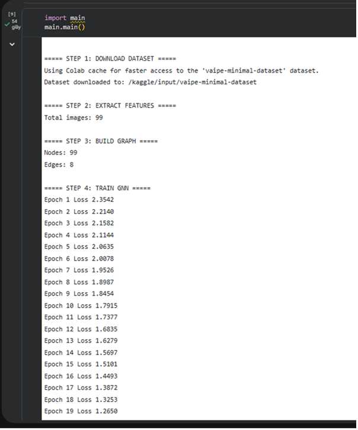
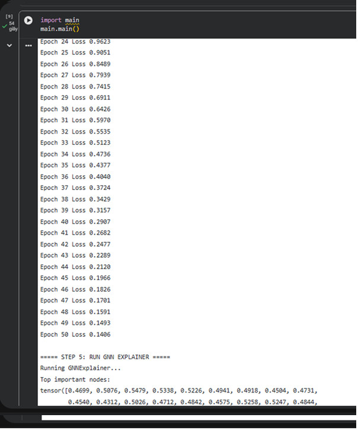
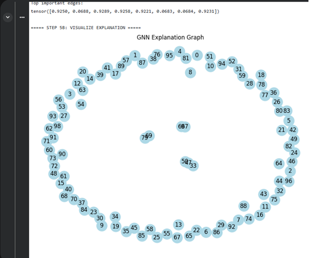
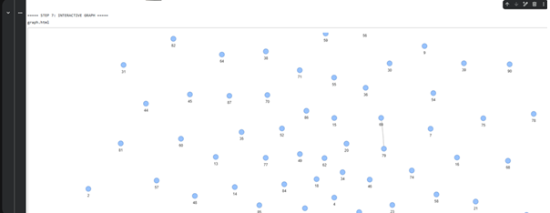

Visualization and Results
Training Pipeline

  

The pipeline includes dataset loading, feature extraction, graph construction, and GNN training. The constructed graph consists of 99 nodes and 8 edges, indicating a sparse structure.

Training Loss (Early Stage)

  

The loss decreases steadily in the early training stage, showing stable learning behavior and effective gradient updates.

Training Loss (Late Stage)

  

The loss converges to approximately 0.14, demonstrating strong model convergence and effective optimization.

GNN Explainer Scores

  

The explainer highlights important nodes and edges. A subset of edges has significantly higher importance, indicating that the model focuses on meaningful relationships.

Explanation Graph

  

This visualization shows the most influential nodes contributing to the prediction, improving model interpretability.

Graph Visualization with Images

  

Each node corresponds to a real image, allowing intuitive understanding of how data is structured in the graph.

Interactive Graph

  

The interactive graph enables dynamic exploration of node relationships and enhances understanding of the graph structure.
